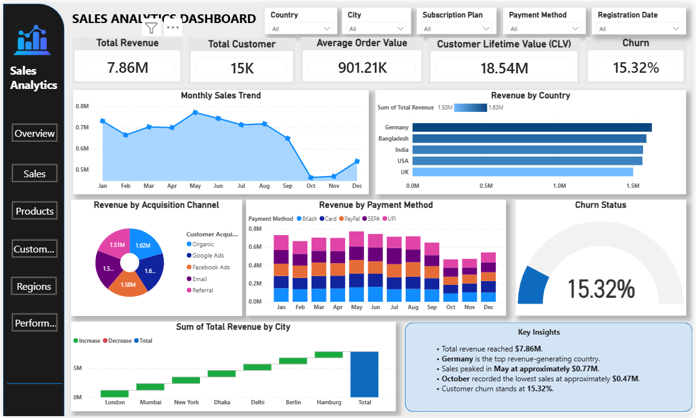

# 📊 Sales Analytics Power BI Dashboard

## 📌 Project Overview

This project is an interactive Sales Analytics Dashboard built using Microsoft Power BI. It analyzes customer behavior, revenue trends, payment methods, customer churn, and sales performance.

---

## 🛠 Tools Used

- Microsoft Excel
- Microsoft Power BI
- DAX

---

## 📂 Dataset

The dataset contains customer information including:

- Customer Details
- Revenue
- Payment Method
- Customer Lifetime Value
- Customer Churn
- Subscription Plan
- Country & City

---

## 📈 Dashboard Features

- 💰 Total Revenue
- 👥 Total Customers
- 🛒 Average Order Value
- 💎 Customer Lifetime Value
- 📉 Monthly Sales Trend
- 🌍 Revenue by Country
- 💳 Revenue by Payment Method
- 📍 Top Cities by Revenue
- 📊 Customer Churn Analysis

---

## 🖼 Dashboard Preview

---

## 📧 Author

**Zineera**
